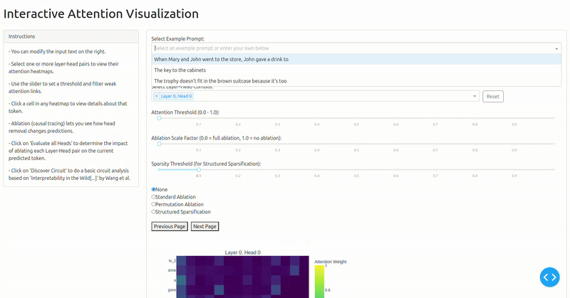
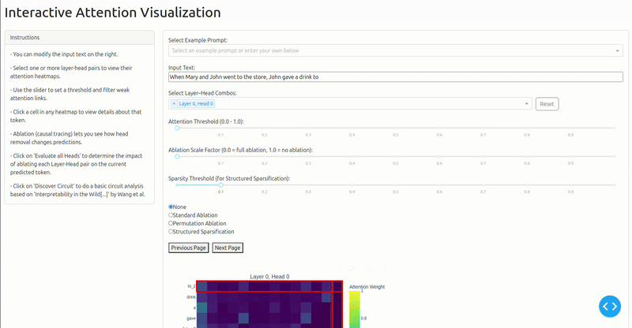
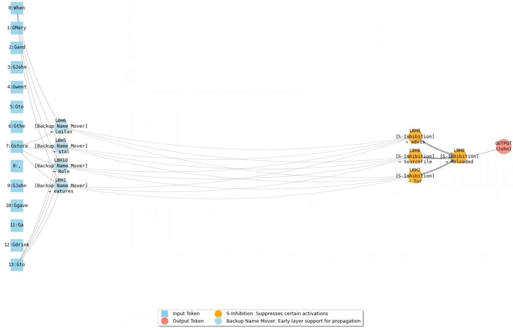

# Attention Visualizer

A custom attention visualizer implementation. This isn't nearly as good as BertViz and the like, but I used the process of implementation as a way of learning more about Mechanistic Interpretability. My hope is to use what I learn here to augment this viz to apply to Vision Language Action (VLA) models. I am invested in controllable and reliable Robotics, and given the recent trend towards ML-based control, studying interpretability seems like the way to go.

## Demo

### Select L-H pairs and Parametrize

You can choose to display any number of layer-head combinations to visualize attention. In addition, you can perform various methods of ablation to study the effect on the next token prediction.



Note: I use `token_#` to denote repeated tokens for clarity.

### Run the Ablation Study

You can take your prompt and run two types of ablation studies:

- Generic: maximize KL-divergence change
- Targeted: pick an alternate token prediction in the dropdown and ablate heads until it becomes the most likely option (this is what I do here)



Here, since we chose `John` as the target token for our ablation study, we can see that many of the resultant attention maps show `to_2`attending to `Mary`, `John`, and `John_2`. We'll explore this in more detail with circuit discovery, but the attention heatmap alone shows that the ablation H-Ls are now masking the repitition `John_2`, allowing `John` to emerge as the next prediction.

Ablating these attention heads that contribute to inhibiting repeated tokens (e.g., suppressing `John`) leads to a prediction shift—from `Mary` (the correct, unique indirect object) to `John` This confirms that the intact circuit is crucial for selecting the appropriate token.


### Discover Circuits

Note that the final output is `John` because we have ablated the shown circuit.



## Specialized Heads

- **S‑Inhibition Heads:** acts to suppress repeated subject tokens, preventing the model from copying the wrong token.
- **Backup Name Mover Heads:** preserves the representation of the correct token in early layers, ensuring its availability downstream.

## Interpretation

The discovered attention circuit, composed of S‑Inhibition and Backup Name Mover heads, steers GPT‑2 toward predicting “Mary.” When the circuit is ablated, the suppression of the repeated token (“John”) is lost, and the model defaults to the more frequent token.

## Usage

```bash
# Create a virtual environment
python -m venv venv

# Activate the virtual environment
source venv/bin/activate

# Install dependencies
pip install -r requirements.txt
```

```bash
python3 main.py

# --> ctrl + click on the link in the terminal.
```


